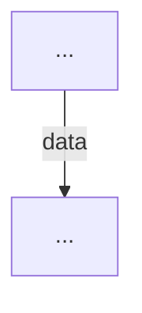

# {Feature Name}

## Why

{Why this feature exists. What problem it solves. Who needs it and why.}

## Data Flow



## Code Ownership

```
{directory}  → {what it owns}
```

## Quality Bar

```
{metric}     {threshold}    current: {value}    {PASS/FAIL}
```

## Gate

**PASS**: {the full chain that must work, one sentence}

**FAIL**: {what constitutes failure, one sentence}

## Certainty

```
{check}      {score}   {evidence}              {date}
```

## Constraints

- README.md MUST be updated when behavior changes and match this manifest
-

## Known Issues

-
