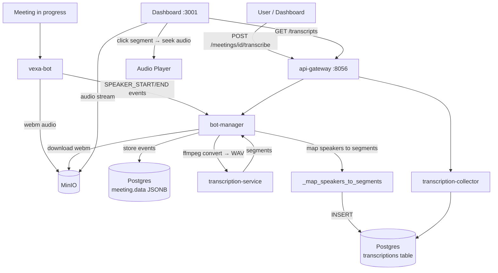

# Post-Meeting Transcription

## Why

Meetings produce recordings and speaker events, but raw audio isn't useful — users need a searchable transcript with speaker labels. Post-meeting transcription takes the recording after a meeting ends, runs it through Whisper, maps speakers using the collected events, and serves it through the dashboard with click-to-seek playback. This is the core value prop for users who couldn't attend or want to review.

## Data Flow



## Code Ownership

```
services/vexa-bot                          → recording, speaker events
packages/meeting-api (bot-manager routes)  → POST /transcribe, speaker mapping
packages/transcription-service             → Whisper inference (ffmpeg + model)
services/transcription-collector           → segment persistence, GET /transcripts
services/dashboard                         → transcript viewer, audio player, seek
libs/shared-models                         → Transcription, Recording, MediaFile models
```

## Quality Bar

```
Capture rate (2 speakers)       >= 90%     current: 100%      PASS
Capture rate (3+ speakers)      >= 80%     current: 92%       PASS
Speaker accuracy (2 speakers)   >= 70%     current: 100%      PASS
Speaker accuracy (3+ speakers)  >= 70%     current: 82%       PASS
WER                             <= 25%     current: 6.6%      PASS
Dashboard renders transcript    renders    current: untested   FAIL
Click segment → audio seeks     < 3s       current: untested   FAIL
Video playback                  renders    current: untested   FAIL
```

## Gate

**PASS**: POST /transcribe → segments with speakers in Postgres → GET /transcripts returns them → dashboard renders segments → clicking segment plays audio from correct timestamp.

**FAIL**: Any step fails, speaker accuracy < 70%, or playback offset > 5s.

## Certainty

```
Recording uploaded to MinIO         90   webm downloaded (551KB)                 2026-03-23
Speaker events persisted            90   15 events in meeting.data               2026-03-23
POST /transcribe succeeds           90   6 segments, language=en                 2026-03-23
Speaker mapping >= 70%              90   82% on 3 speakers                       2026-03-23
GET /transcripts returns segments   80   works with vxa_user_ token              2026-03-23
Dashboard renders transcript        30   not browser-tested                      2026-03-23
Dashboard playback seeks correctly  30   duration_seconds=null may break         2026-03-23
Video playback in dashboard         30   3 bugs fixed, container rebuild needed  2026-03-24
3+ speaker stress test              90   82% speaker, 92% capture               2026-03-23
```

## Constraints

- All client-facing API calls go through api-gateway — dashboard never calls bot-manager or transcription-collector directly
- bot-manager owns transcription orchestration (download → Whisper → map → persist) — no other service duplicates this
- Dashboard fetches transcripts via `GET /transcripts` through api-gateway, never queries Postgres directly
- Auth is `X-API-Key` validated at gateway — services trust injected `X-User-ID` headers
- No Python imports across service boundaries
- Recording storage is MinIO only — no local filesystem
- Speaker mapping runs inside bot-manager — not a separate service
- Segments are immutable after 30s — no updates to persisted rows
- README.md MUST be updated when behavior changes and match this manifest

## Known Issues

- `duration_seconds=null` on recordings may break audio seek
- Short utterances (1 word) get "Unknown" speaker
- Rapid speaker turns misattribute due to event boundary lag
- Whisper splits long monologues → scorer can't match 1:N
- Video needs container rebuild (ffmpeg added to runtime Dockerfile)
