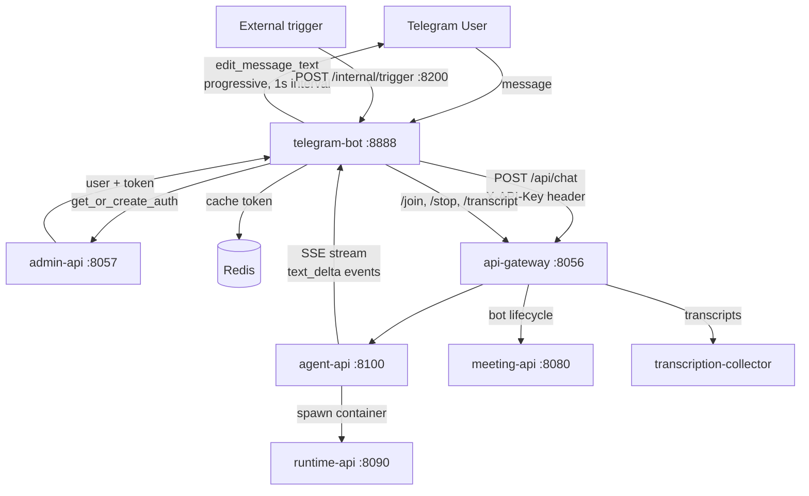

# Telegram Chat

## Why

Users want to interact with their meeting AI agent from Telegram — ask questions about past meetings, join/stop bots, manage sessions — without opening the dashboard. Telegram is where they already are. The bot bridges Telegram to the agent-api, streaming responses progressively so the conversation feels real-time.

## Data Flow



## Code Ownership

```
services/telegram-bot/bot.py     → all Telegram integration, SSE streaming, commands
services/telegram-bot/tests/     → unit + E2E tests
packages/agent-api               → chat SSE, sessions, workspace API
packages/runtime-api             → container lifecycle for agent sessions
services/admin-api               → user creation, token minting
```

## Quality Bar

```
Unit tests pass                 37/37      current: 52/52      PASS
Message round-trip (E2E)        streamed   current: verified   PASS
Session commands                all work   current: verified   PASS
Meeting commands                all work   current: verified   PASS
Markdown rendering              renders    current: tested     PASS
Stop button (interrupt)         works      current: verified   PASS
Token refresh on revocation     recovers   current: 24h TTL    PASS
Concurrent users                no leak    current: keyed      PASS
Group chat                      graceful   current: @mention   PASS
```

## Gate

**PASS**: Send Telegram message → agent-api streams response → bot progressively edits message → user sees complete response. All commands work.

**FAIL**: Message not forwarded, stream broken, response not displayed, or any command errors.

## Certainty

```
Auto-create auth                 90   get_or_create_auth(), 4 unit tests        2026-03-25
Message forwarding to agent-api  90   SSE streaming verified live               2026-03-25
Progressive message editing      90   _safe_edit with 1s interval               2026-03-25
Multi-message chunking           90   _chunk_text splits at boundaries          2026-03-25
Session commands                 90   /new, /sessions both tested live          2026-03-25
Meeting commands                 85   /join, /stop, /transcript tested live     2026-03-25
Stop button                      90   inline keyboard + DELETE /api/chat        2026-03-25
Markdown → HTML                  90   code blocks, bold, italic, links          2026-03-25
Trigger API                      85   FastAPI /internal/trigger, not E2E        2026-03-25
Token caching                    90   Redis SET/GET with 24h TTL + 403 refresh  2026-03-27
Concurrent users                 90   state keyed by (chat_id, user_id)         2026-03-27
Group chat                       90   @mention + reply filter                   2026-03-27
```

## Constraints

- telegram-bot is the ONLY Telegram integration point — no other service talks to Telegram API
- All meeting/agent operations go through api-gateway — never call services directly
- Auth: bot calls admin-api for token, uses it as `X-API-Key` for gateway requests
- Chat uses SSE streaming from agent-api `/api/chat` — no polling, no webhooks for responses
- Session state lives in agent-api + Redis — bot is stateless except cached auth token
- No Python imports from packages/ — standalone service
- Progressive message editing (1s interval) — never send multiple messages for one response
- Trigger API (`/internal/trigger`) is internal only — not exposed through gateway
- README.md MUST be updated when behavior changes and match this manifest

## Known Issues

- No retry/backoff on API errors (single-shot with error message)
- Telegram transport layer untested (no TELEGRAM_BOT_TOKEN configured)
