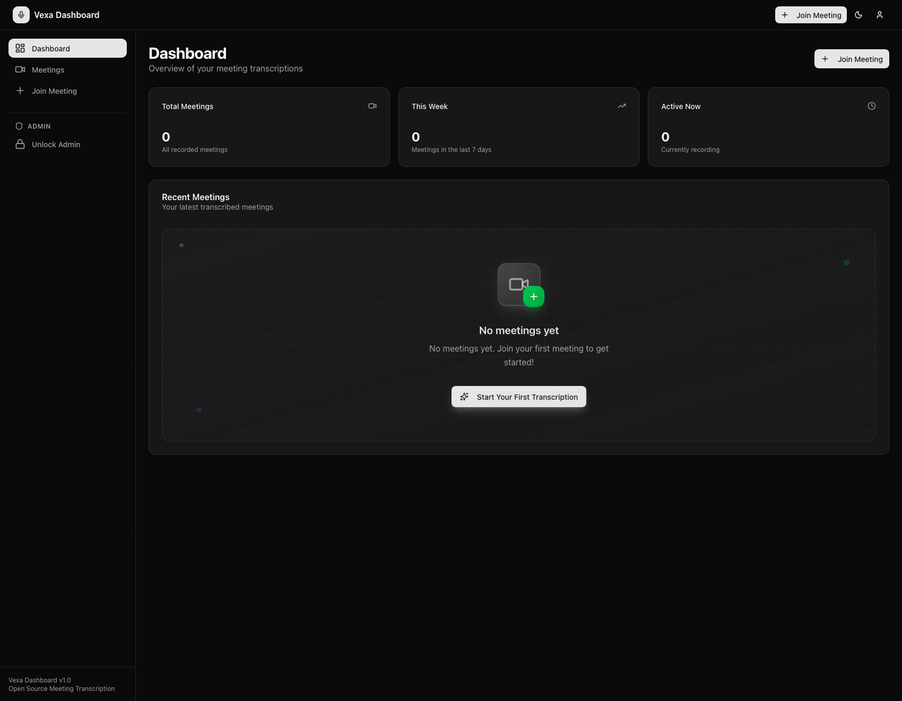
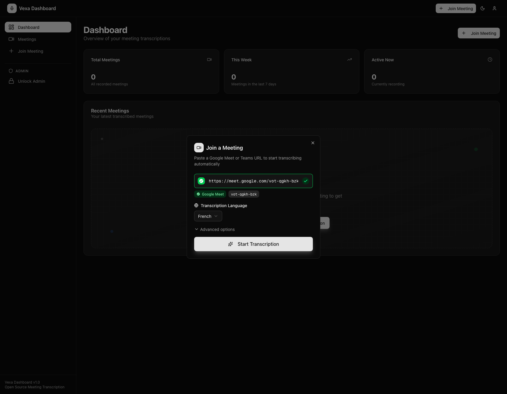
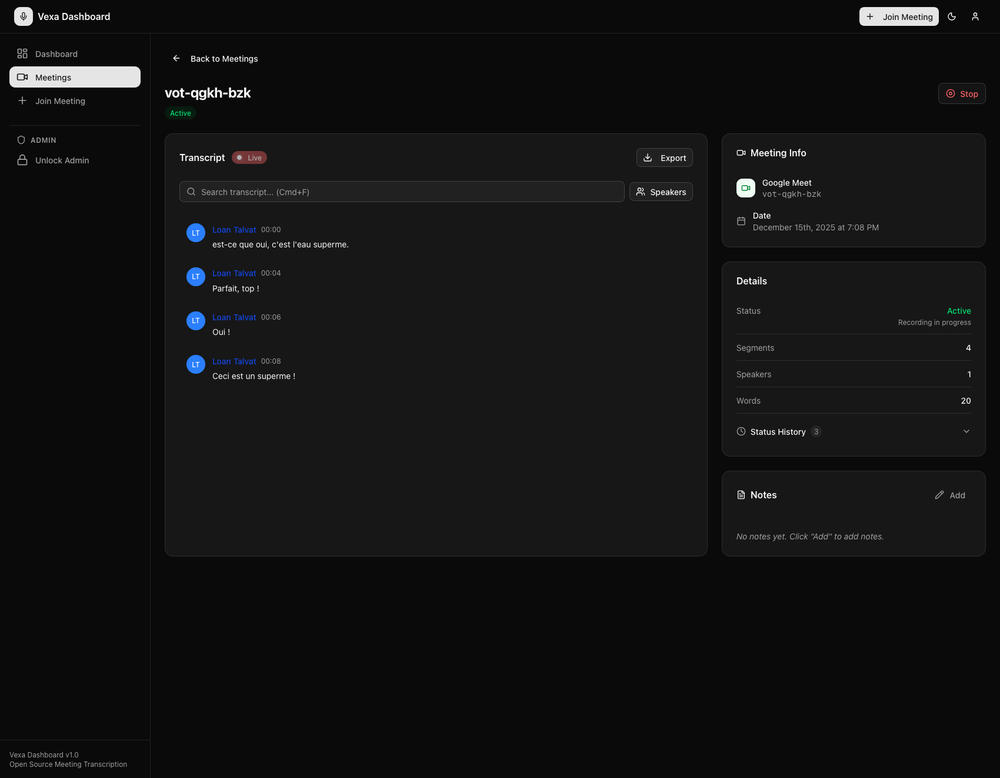

# Vexa Dashboard

## Why

Users need a visual interface to launch bots into meetings, watch live transcripts with speaker attribution, manage API tokens, and review past meetings. Without the dashboard, all interaction with Vexa requires direct API calls. The dashboard provides the self-service experience for non-technical users and a convenient dev tool for API users.

## What

A Next.js web application that provides:
- Meeting management: launch bots, see active/past meetings
- Live transcript viewer: real-time segments via WebSocket with speaker labels
- Recording playback: audio player synced with transcript segments
- User/token management: create API keys, configure webhooks
- Admin analytics: user and meeting statistics

### Documentation
- [Dashboard UI](../../docs/ui-dashboard.mdx)

### Dependencies

- **api-gateway** -- all API calls route through the gateway
- **admin-api** (via gateway) -- user authentication and token management
- No direct database access -- fully API-driven

## How

See Quick Start and Local Development sections below.

---

Open-source web UI for [Vexa](https://github.com/Vexa-ai/vexa): join meetings, watch live transcripts, manage users/tokens, and review transcript history.

Main backend repo: [Vexa](https://github.com/Vexa-ai/vexa)

## Quick Start (Docker)

```bash
docker run --rm -p 3000:3000 \
  -e VEXA_API_URL=http://your-vexa-host:8056 \
  -e VEXA_ADMIN_API_KEY=your_admin_api_key \
  vexaai/vexa-dashboard:latest
```

Then open `http://localhost:3000`. (The container listens on port 3000; the `npm run dev` server uses port 3001.)

## Local Development

The dashboard lives in the Vexa monorepo at `services/dashboard/`.

```bash
git clone https://github.com/Vexa-ai/vexa.git
cd vexa/services/dashboard
npm install
cp .env.example .env.local
npm run dev
```

Local dev server runs on `http://localhost:3001`.

## Recording Playback (Post-Meeting)

On completed meetings, the meeting detail page can show an audio playback strip (if a recording exists) and highlight transcript segments during playback. Clicking a segment seeks the audio.

Backend requirements:
- Vexa must expose recordings in the transcript response (so the dashboard can discover recordings without extra calls).
- `GET /recordings/{recording_id}/media/{media_file_id}/raw` should stream audio with `Range` support (`206`) and `Content-Disposition: inline` so browser seeking works.

Notes:
- The dashboard fetches audio through its own `/api/vexa/...` proxy to avoid MinIO/S3 CORS issues.

## Zoom Notes

Zoom meeting joins require additional setup in the Vexa backend (Zoom Meeting SDK + OAuth/OBF). See the Vexa repo doc: `docs/zoom-app-setup.mdx`.

## Required Configuration

| Variable | Required | Notes |
|---|---|---|
| `VEXA_API_URL` | Yes | Vexa API base URL (usually `http://localhost:8056` for local Vexa) |
| `VEXA_ADMIN_API_KEY` | Yes | Admin API key used for auth/user management |
| `VEXA_ADMIN_API_URL` | No | Optional override; defaults to `VEXA_API_URL` |

## Common Optional Configuration

| Area | Variables |
|---|---|
| Session/auth | `NEXTAUTH_URL`, `NEXTAUTH_SECRET`, `JWT_SECRET`, `NEXT_PUBLIC_APP_URL` |
| Magic-link email | `SMTP_HOST`, `SMTP_PORT`, `SMTP_SECURE`, `SMTP_USER`, `SMTP_PASS`, `SMTP_FROM` |
| Google OAuth | `ENABLE_GOOGLE_AUTH`, `GOOGLE_CLIENT_ID`, `GOOGLE_CLIENT_SECRET` |
| Zoom OAuth | `ZOOM_OAUTH_CLIENT_ID`, `ZOOM_OAUTH_CLIENT_SECRET`, `ZOOM_OAUTH_REDIRECT_URI`, `ZOOM_OAUTH_STATE_SECRET` |
| AI assistant | `AI_MODEL`, `AI_API_KEY`, `AI_BASE_URL` |
| Registration policy | `ALLOW_REGISTRATIONS`, `ALLOWED_EMAIL_DOMAINS` |
| Bot defaults | `DEFAULT_BOT_NAME` |
| Hosted mode | `NEXT_PUBLIC_HOSTED_MODE` |
| Frontend/public URLs | `NEXT_PUBLIC_APP_URL`, `NEXT_PUBLIC_BASE_URL`, `NEXT_PUBLIC_TRANSCRIPT_SHARE_BASE_URL`, `NEXT_PUBLIC_VEXA_WS_URL`, `NEXT_PUBLIC_WEBAPP_URL` |

See `.env.example` for a complete template.

## Compose Example

```yaml
services:
  vexa-dashboard:
    image: vexaai/vexa-dashboard:latest
    ports:
      - "3000:3000"
    environment:
      VEXA_API_URL: http://vexa:8056
      VEXA_ADMIN_API_KEY: ${VEXA_ADMIN_API_KEY}
```

## Test

```bash
cd services/dashboard
npm install
npm test
```

Runs vitest against `tests/` — covers `parseMeetingInput`, `parseUTCTimestamp`, `cn`, and language utilities.

## Troubleshooting

- Login or admin routes fail: verify `VEXA_ADMIN_API_KEY` is valid.
- Dashboard loads but data is empty: verify `VEXA_API_URL` is reachable from the container/runtime.
- OAuth callbacks fail: verify `NEXTAUTH_URL` and provider redirect URIs match exactly.

## Screenshots





## Related

- [Vexa deployment guide](https://github.com/Vexa-ai/vexa/blob/main/docs/deployment.mdx)
- [Vexa Lite deployment guide](https://github.com/Vexa-ai/vexa/blob/main/docs/vexa-lite-deployment.mdx)
- [Vexa API guide](https://github.com/Vexa-ai/vexa/blob/main/docs/user_api_guide.mdx)

## License

Apache-2.0 (`LICENSE`)
